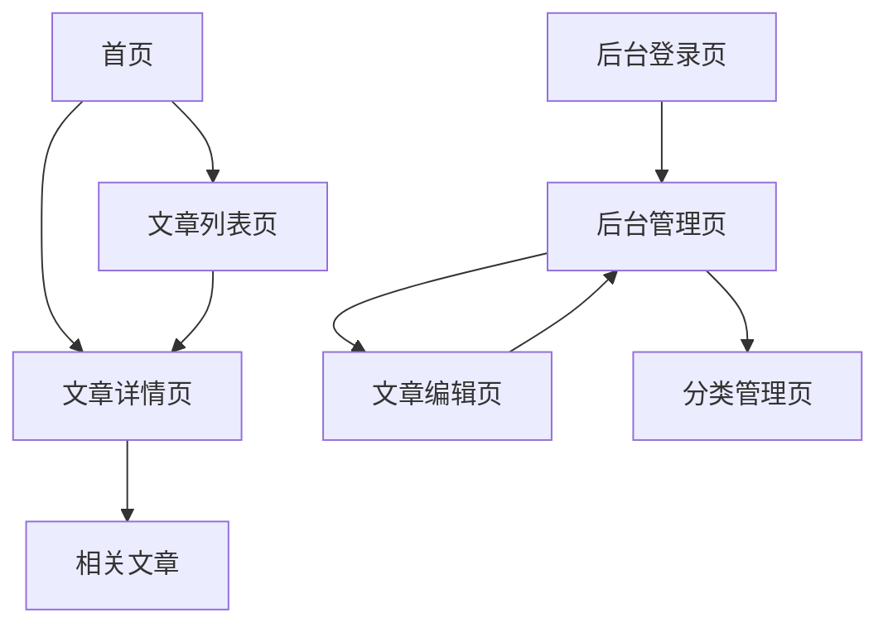

# 博客系统产品需求文档 (PRD)

## 1. 产品概述

一个简洁优雅的博客系统，支持作者在火山云ECS服务器上部署，拥有独立域名，可发布图文并茂的文章内容。

**目标用户**：个人博主、技术写作者、内容创作者
**核心价值**：提供流畅的写作体验，支持富文本编辑和图片上传，让读者获得舒适的阅读体验

## 2. 核心功能

### 2.1 用户角色

| 角色 | 注册/登录方式 | 核心权限 |
|------|---------------|----------|
| 博主（管理员） | 邮箱注册 + 密码登录 | 文章发布/编辑/删除、分类管理、图片上传、系统设置 |
| 访客 | 无需注册 | 浏览文章、搜索内容、查看分类和标签 |

### 2.2 功能模块

博客系统包含以下核心页面：

1. **首页**：展示最新文章、热门文章、分类导航、博客简介
2. **文章列表页**：按分类/标签筛选文章，分页展示
3. **文章详情页**：完整文章内容阅读、图片展示、相关文章推荐
4. **后台管理页**：文章管理列表、数据统计概览
5. **文章编辑页**：富文本编辑器、图片上传、分类选择、文章发布

### 2.3 页面详情

| 页面名称 | 模块名称 | 功能描述 |
|----------|----------|----------|
| 首页 | Hero区域 | 展示博客标题、简介、背景图，突出博客品牌 |
| 首页 | 最新文章 | 展示最近发布的5-8篇文章卡片（标题、摘要、封面图、发布时间） |
| 首页 | 分类导航 | 展示所有文章分类，支持点击进入分类页 |
| 首页 | 页脚 | 版权信息、联系方式、备案号 |
| 文章列表页 | 筛选栏 | 按分类、标签筛选文章，支持搜索关键词 |
| 文章列表页 | 文章卡片列表 | 分页展示文章卡片，每页10条，含封面图、标题、摘要、发布时间、阅读量 |
| 文章列表页 | 分页器 | 页码导航，支持上一页/下一页 |
| 文章详情页 | 文章头部 | 文章标题、发布时间、分类标签、阅读时长估算 |
| 文章详情页 | 文章内容 | 富文本渲染，支持图片、代码块、引用等格式 |
| 文章详情页 | 文章底部 | 分享按钮、上一篇/下一篇导航 |
| 后台管理页 | 登录模块 | 博主邮箱+密码登录，登录状态保持 |
| 后台管理页 | 仪表盘 | 统计文章总数、总阅读量、最近发布动态 |
| 后台管理页 | 文章管理 | 文章列表（支持编辑、删除、发布/下架）、搜索文章 |
| 后台管理页 | 分类管理 | 添加/编辑/删除文章分类 |
| 文章编辑页 | 编辑器 | 富文本编辑器（支持Markdown或WYSIWYG），实时预览 |
| 文章编辑页 | 文章设置 | 填写标题、选择分类、添加标签、上传封面图 |
| 文章编辑页 | 图片上传 | 拖拽/点击上传图片，插入到文章正文 |
| 文章编辑页 | 发布控制 | 保存草稿、立即发布、定时发布 |

## 3. 核心流程

### 3.1 访客浏览流程

访客访问博客首页 → 浏览最新文章列表 → 点击感兴趣的文章 → 阅读完整内容 → 可返回首页或查看相关文章

### 3.2 博主写作流程

博主访问管理后台 → 登录账号 → 进入文章编辑页 → 编写文章内容（支持图片上传）→ 设置分类标签 → 发布文章 → 在文章管理页查看/编辑

### 3.3 页面导航流程

## 4. 用户界面设计

### 4.1 设计风格

- **主色调**：深蓝 (#1e3a5f) 作为主色，白色 (#ffffff) 作为背景，灰色 (#f5f5f5) 作为辅助背景
- **强调色**：橙色 (#ff6b35) 用于按钮和重点元素
- **按钮样式**：圆角矩形（border-radius: 8px），扁平化设计
- **字体**：中文使用 "Noto Sans SC"，英文使用 "Inter"；标题 24-32px，正文 16px，辅助文字 14px
- **布局风格**：卡片式布局，顶部固定导航栏，内容区居中最大宽度 1200px
- **图标风格**：使用 Lucide 图标库，线性风格，粗细一致

### 4.2 页面设计概述

| 页面名称 | 模块名称 | UI元素说明 |
|----------|----------|------------|
| 首页 | Hero区域 | 全宽背景图，半透明遮罩，居中大标题和简介文字，向下滚动指示器 |
| 首页 | 文章卡片 | 白色卡片，圆角12px，阴影hover效果，左侧封面图（16:10比例），右侧标题和摘要 |
| 文章列表页 | 筛选栏 | 顶部固定，分类下拉选择器 + 搜索输入框 + 搜索按钮 |
| 文章详情页 | 内容区 | 白色背景，最大宽度800px居中，标题32px加粗，正文18px行高1.8，图片圆角8px |
| 后台管理页 | 侧边栏 | 固定左侧，深色背景，导航菜单图标+文字 |
| 后台管理页 | 数据卡片 | 顶部4个统计卡片，图标+数字+标签，浅灰背景 |
| 文章编辑页 | 编辑器 | 分栏布局，左侧编辑区，右侧实时预览，工具栏固定在顶部 |
| 文章编辑页 | 图片上传 | 拖拽区域，虚线边框，上传进度条，上传成功后显示缩略图 |

### 4.3 响应式设计

- **桌面优先**：主要设计基于 1200px+ 屏幕宽度
- **平板适配**：768px - 1199px，文章卡片改为单列，侧边栏收起为图标
- **移动端适配**：< 768px，导航改为汉堡菜单，文章列表单列，编辑器改为单栏（编辑/预览切换）

### 4.4 交互细节

- 文章卡片 hover 时轻微上浮（transform: translateY(-4px)）并增强阴影
- 按钮点击时有轻微缩放反馈（scale: 0.98）
- 图片上传时有进度动画
- 页面切换使用淡入淡出过渡效果（300ms）
- 编辑器自动保存草稿，每30秒保存一次，显示保存状态提示
