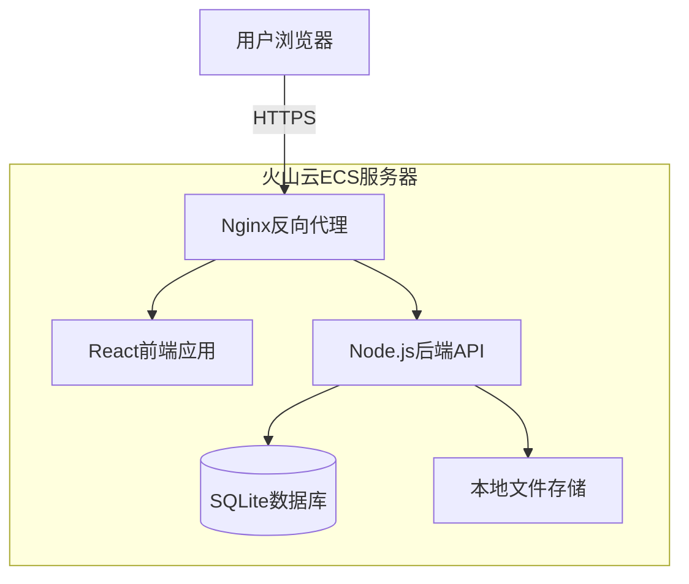
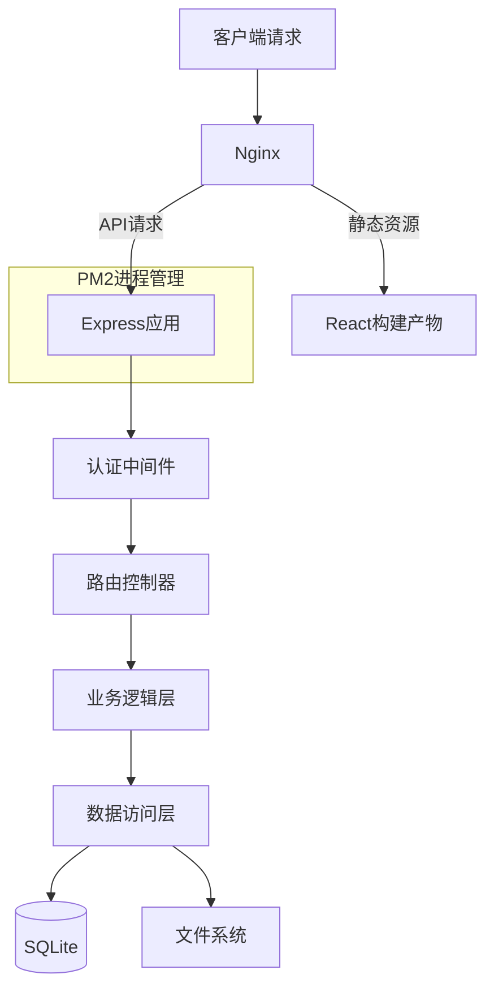
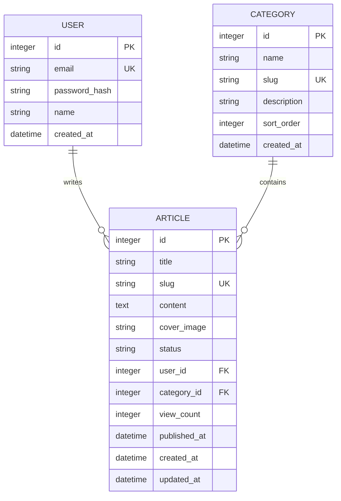

# 博客系统技术架构文档

## 1. 架构设计



## 2. 技术描述

- **前端**: React@18 + TypeScript@5 + TailwindCSS@3 + Vite@5
- **初始化工具**: vite-init
- **后端**: Node.js@20 + Express@4
- **数据库**: SQLite3（轻量级，无需额外服务）
- **进程管理**: PM2
- **反向代理**: Nginx
- **文件存储**: 本地文件系统（/uploads目录）

## 3. 路由定义

| 路由 | 用途 |
|------|------|
| / | 首页，展示最新文章和博客简介 |
| /articles | 文章列表页，支持分类筛选和搜索 |
| /articles/:slug | 文章详情页，展示完整文章内容 |
| /admin/login | 后台登录页 |
| /admin/dashboard | 后台仪表盘，数据统计概览 |
| /admin/articles | 文章管理列表 |
| /admin/articles/new | 新建文章页 |
| /admin/articles/:id/edit | 编辑文章页 |
| /admin/categories | 分类管理页 |

## 4. API定义

### 4.1 认证相关

**POST /api/auth/login**

请求:
| 参数名 | 参数类型 | 是否必填 | 说明 |
|--------|----------|----------|------|
| email | string | 是 | 博主邮箱 |
| password | string | 是 | 密码（MD5加密） |

响应:
| 参数名 | 参数类型 | 说明 |
|--------|----------|------|
| success | boolean | 登录状态 |
| token | string | JWT令牌 |
| user | object | 用户信息 |

### 4.2 文章相关

**GET /api/articles**

请求:
| 参数名 | 参数类型 | 是否必填 | 说明 |
|--------|----------|----------|------|
| page | number | 否 | 页码，默认1 |
| limit | number | 否 | 每页数量，默认10 |
| category | string | 否 | 分类slug |
| search | string | 否 | 搜索关键词 |

**POST /api/articles** (需要认证)

请求:
| 参数名 | 参数类型 | 是否必填 | 说明 |
|--------|----------|----------|------|
| title | string | 是 | 文章标题 |
| content | string | 是 | 文章内容（HTML） |
| category_id | number | 是 | 分类ID |
| cover_image | string | 否 | 封面图路径 |
| status | string | 是 | 状态：draft/published |

**PUT /api/articles/:id** (需要认证)

**DELETE /api/articles/:id** (需要认证)

### 4.3 图片上传

**POST /api/upload** (需要认证)

请求: multipart/form-data
| 参数名 | 参数类型 | 是否必填 | 说明 |
|--------|----------|----------|------|
| file | File | 是 | 图片文件 |

响应:
| 参数名 | 参数类型 | 说明 |
|--------|----------|------|
| success | boolean | 上传状态 |
| url | string | 图片访问URL |

## 5. 服务器架构图



## 6. 数据模型

### 6.1 数据模型定义



### 6.2 数据定义语言

**用户表 (users)**
```sql
CREATE TABLE users (
    id INTEGER PRIMARY KEY AUTOINCREMENT,
    email VARCHAR(255) UNIQUE NOT NULL,
    password_hash VARCHAR(255) NOT NULL,
    name VARCHAR(100) NOT NULL,
    created_at DATETIME DEFAULT CURRENT_TIMESTAMP
);

-- 初始化管理员账号（密码: admin123）
INSERT INTO users (email, password_hash, name) 
VALUES ('admin@blog.com', '0192023a7bbd73250516f069df18b500', '博主');
```

**分类表 (categories)**
```sql
CREATE TABLE categories (
    id INTEGER PRIMARY KEY AUTOINCREMENT,
    name VARCHAR(100) NOT NULL,
    slug VARCHAR(100) UNIQUE NOT NULL,
    description TEXT,
    sort_order INTEGER DEFAULT 0,
    created_at DATETIME DEFAULT CURRENT_TIMESTAMP
);

-- 初始化默认分类
INSERT INTO categories (name, slug, description, sort_order) VALUES 
('技术', 'tech', '技术文章分享', 1),
('生活', 'life', '生活随笔', 2),
('随笔', 'notes', '随想随记', 3);
```

**文章表 (articles)**
```sql
CREATE TABLE articles (
    id INTEGER PRIMARY KEY AUTOINCREMENT,
    title VARCHAR(255) NOT NULL,
    slug VARCHAR(255) UNIQUE NOT NULL,
    content TEXT NOT NULL,
    cover_image VARCHAR(500),
    status VARCHAR(20) DEFAULT 'draft' CHECK (status IN ('draft', 'published')),
    user_id INTEGER NOT NULL,
    category_id INTEGER,
    view_count INTEGER DEFAULT 0,
    published_at DATETIME,
    created_at DATETIME DEFAULT CURRENT_TIMESTAMP,
    updated_at DATETIME DEFAULT CURRENT_TIMESTAMP,
    FOREIGN KEY (user_id) REFERENCES users(id),
    FOREIGN KEY (category_id) REFERENCES categories(id)
);

CREATE INDEX idx_articles_status ON articles(status);
CREATE INDEX idx_articles_category ON articles(category_id);
CREATE INDEX idx_articles_created_at ON articles(created_at DESC);
```

## 7. 部署架构

### 7.1 目录结构
```
/blog/
├── client/              # React前端
│   ├── dist/           # 构建产物
│   └── ...
├── server/             # Express后端
│   ├── uploads/        # 上传文件目录
│   ├── database/       # SQLite数据库文件
│   └── ...
├── nginx.conf          # Nginx配置
└── ecosystem.config.js # PM2配置
```

### 7.2 Nginx配置
```nginx
server {
    listen 80;
    server_name your-domain.com;
    
    # 静态资源
    location / {
        root /blog/client/dist;
        try_files $uri $uri/ /index.html;
    }
    
    # API代理
    location /api {
        proxy_pass http://localhost:3000;
        proxy_set_header Host $host;
        proxy_set_header X-Real-IP $remote_addr;
    }
    
    # 上传文件
    location /uploads {
        alias /blog/server/uploads;
    }
}
```

### 7.3 PM2配置
```javascript
module.exports = {
  apps: [{
    name: 'blog-server',
    script: './server/app.js',
    instances: 1,
    autorestart: true,
    watch: false,
    max_memory_restart: '500M',
    env: {
      NODE_ENV: 'production',
      PORT: 3000,
      JWT_SECRET: 'your-secret-key'
    }
  }]
};
```

## 8. 域名和SSL配置

### 8.1 域名解析
- 在域名服务商处添加A记录，指向火山云ECS公网IP

### 8.2 SSL证书（使用Certbot免费证书）
```bash
# 安装Certbot
sudo apt install certbot python3-certbot-nginx

# 申请证书
sudo certbot --nginx -d your-domain.com

# 自动续期
sudo certbot renew --dry-run
```

## 9. 依赖清单

### 前端依赖
```json
{
  "dependencies": {
    "react": "^18.2.0",
    "react-dom": "^18.2.0",
    "react-router-dom": "^6.20.0",
    "axios": "^1.6.0",
    "lucide-react": "^0.294.0"
  },
  "devDependencies": {
    "@types/react": "^18.2.0",
    "@types/react-dom": "^18.2.0",
    "@vitejs/plugin-react": "^4.2.0",
    "autoprefixer": "^10.4.16",
    "postcss": "^8.4.32",
    "tailwindcss": "^3.3.6",
    "typescript": "^5.3.0",
    "vite": "^5.0.0"
  }
}
```

### 后端依赖
```json
{
  "dependencies": {
    "express": "^4.18.2",
    "cors": "^2.8.5",
    "multer": "^1.4.5-lts.1",
    "jsonwebtoken": "^9.0.2",
    "bcryptjs": "^2.4.3",
    "sqlite3": "^5.1.6",
    "uuid": "^9.0.1"
  }
}
```
